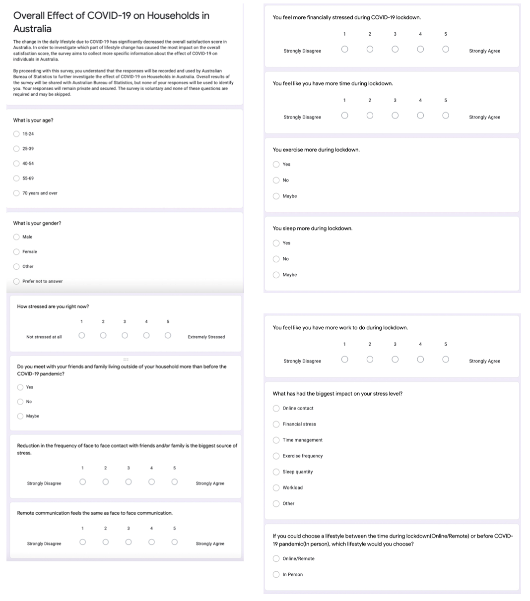

```{r setup, include=FALSE}
knitr::opts_chunk$set(echo = TRUE)

library(tidyverse)
library(dplyr)
library(knitr)
library(bookdown)
library(kableExtra)
library(ggplot2)
```

# Introduction

The COVID-19 pandemic has had a heavy impact on the physical and mental health of many across the world. Since the beginning of the COVID-19 pandemic in 2020, people around the world have been required to refrain from in-person contact, resulting in a major lifestyle change. School and jobs transferred online, and masks had to be worn at all times. In Australia, in response to the pandemic, non-essential businesses and social gatherings were restricted. In addition, Australia pursued a zero-COVID suppression strategy until late 2021 by strictly controlling international arrivals and quickly responding to local outbreaks. The combination of a rapid response along with its geographic isolation resulted in a relatively quick COVID-19 recovery compared to other developed countries [@citeForbes]. However, there are still clear indications of a decrease in overall life satisfaction in the country since the beginning of the pandemic. Thus, in this paper, we will investigate the factors related to the decrease in life satisfaction and discuss what it all means.

To investigate the causes of decreased life satisfaction in Australia, this paper aims to examine different variables to see if there is any correlation between the life satisfaction score and a certain variable. The data we will be using for the analysis is a response to the General Social Survey provided by the Australian Bureau of Statistics [@citeABS1]. The survey asked the citizens a variety of questions about their social experiences and mental health. We used the provided data and compared different variables to test which variable had the biggest influence on our independent variable, the overall satisfaction score. 

The results of our investigation indicate a significant decrease in the life satisfaction scores among citizens in Australia after the COVID-19 pandemic along with the number of face to face contact with friends and family living outside of their household. However, surprisingly, there were no other variables that showed a significant change during the pandemic. This paper consists of different tables and graphs for each variable showing the opposite result from what we expected initially. Thus, the reduction in the frequency of face to face contact seems to be the most influential factor. To investigate further to support our conclusion, we will also produce our own supplementary survey, asking more detailed and specific questions about our investigation.

The statistical analysis in this report will be done using `R` [@citeR]. The R Packages, `tidyverse` [@citeTidyverse] and `dplyr` [@citeDplyr] will be used for data manipulation and cleaning. The graphs and tables for this report will created and formatted with `ggplot2` [@citeggplot] and `kableExtra` [@citekable]. The packages `bookdown` [@citebookdown] and `knitr` [@citeKnitr] will be used to format this report.

# Data

## The Survey

The data that will be used in this report is taken from a General Social Survey conducted by the Australian Bureau of Statistics [@citeABS1]. The survey asked citizens a variety of questions related to how they were feeling during 2020 and the COVID-19 Pandemic. Citizens were surveyed on several different topics about their lives such as their wellbeing, social experiences, work and more. Each of these topics consisted of several different subtopics, meaning many aspects of life were touched upon in the survey, giving us a wide range of data to work with.

The target population of the survey was all Australian citizens of the ages 15 and up. As it would be difficult to get data from people all throughout the nation, the survey focused on a sampling frame consisting of those living in private dwellings located in the non-remote, denser areas of Australia [@citeABS2]. From this population and frame, the Australian Bureau of Statistics obtained a sample population of around 5,300 different households.

The Australian Bureau of Statistics combined a few different sampling methods in order to obtain their data. First, a type of stratified sampling method was used where Australia was broken up and grouped into many different areas or strata. Of these areas, those that had a lower socio-economic status had a higher probability of being selected for the survey, and other strata had lower probabilities. Due to this, the sample of areas chosen would more so represent those who were at a larger disadvantage socially and economically, which is what the Bureau wanted to truly assess the status of their population [@citeABS2]. After certain areas were sampled based on their probabilities, simple random sampling was completed to select several households within each of the selected areas. This means each household with a specific selected area had an equal, random chance of being selected to participate. 

Overall, the sampling methods used to gain data for the survey were quite strong. The use of stratified sampling where the population was grouped by socio-economic status ensured that each area of the country was properly represented based on their importance due to the specific probabilities given to each specific group. This is important as it allows Australia to sufficiently draw conclusions about their entire population just by using the sample, since the samples was curated in a way where the proportion of each group in the survey should be fairly similar to the believed proportion of the entire population that the group makes up [@citeMoss]. Additionally, following this up with simple random sampling was an effective way to limit costs and time consumption after a more difficult stratified process, while still successfully selecting households in a way that they will properly be able to represent the entire population [@citeDepersio]. Of course, since the Bureau is only taking a sample of households from their entire country, their data will never be 100% perfect at representing the population, but they still do a good job at limiting their error based on the methods used.

As for the contents of the survey itself, the Australian Bureau of Statistics asked several good questions that provides us with valuable information about Australia's population. One big strength about the survey is that not only does it give us statistics on general aspects like wellbeing, but it also asks other more specific questions that allow us to see what exactly is causing Australians to feel a certain way. This allows us to draw conclusions about what has caused certain changes in the data over the years, and tell an informative story about said changes. While the survey was very strong and helpful, the way the Bureau presented the data could have been more successful. The datasets provided by the Bureau that show the data do not include the answers of each individual household, but instead, present them as averages. While this still gives us great data points to work with, more accurate conclusions may have been able to be drawn had the data points of each respondent been provided. 

## Data Limitations

There is unfortunately one substantial downside to the data. It is important to note that the survey was conducted from June 15th to September 5th of 2020, and this time period was concurrent with a lockdown in Australia due to COVID-19. As a result of this, the methodology used in the 2020 survey differed from the methodology used in previous years due to safety protocols and restrictions. In 2020, data was collected from citizens either online or over the telephone only, whereas in the previous years they would also conduct face to face interviews with those who did not respond. These face to face interviews allowed the Bureau to limit non-response bias as they pursued the non-respondents and were able to get them to respond. Unfortunately, due to the pandemic, they could not conduct any in-person interviews and were unable to follow up with those who did not respond initially. This caused there to be a lot of non-response bias in the surveying, as the response rate decreased by almost 33%, dropping to about 60% from around 80% in both 2014 and 2019.

The issue with this non-response while surveying is that the people who do not respond tend to be very different compared to those who did respond [@citePrince]. As a result of this, there will be a lot of bias in the data since there is a big difference between those who were surveyed and the true population [@citeBose]. The true population will not be properly represented since the different thoughts, facts and opinions of the typical non-responder will not be conveyed in the data, and the data will be skewed towards being more representative of the lives of people who did respond, causing the data to be biased. An example of this non-response bias in this survey, which will be discussed further in Section \@ref(discussion), is how the well being of Australians may be overstated in the survey since those who are mentally unwell were less likely to participate compared to those who were in a good place mentally and thus responded. Thus, those who did not respond were very different from the typical people who did respond, and it will be reflected in the data causing bias.

## The Datasets

The Australian Bureau of Statistics used the survey responses to create a large variety of different datasets each of which tell us something different. Within the datasets, data from both the current survey done in 2020 as well as surveys done in previous years is included. The values in the datasets are also mainly displayed as average answers among respondents. In this paper, we will be focusing on analyzing two of the larger, more important datasets provided. This analysis will be conducted using R [@citeR] and many of the helpful packages within it, such as Tidyverse [@citeTidyverse], Dplyr [@citeDplyr], and Knitr [@citeKnitr], where several tables and figures will be created to give us more insight on the datasets and allow for a story to be told based on the data.

The first dataset that will be used displays the average overall life satisfaction on a scale of 1-10 of Australians, where averages are shown based on specific types of groupings. Life satisfaction is described as how each respondent feels about their current wellbeing and happiness, with 10 being 100% happy and 0 being not happy at all.

```{r dataextract1, echo = FALSE, message=FALSE}

#Load in dataset
satisfaction_full <- read_csv(here::here("inputs/data/Life_Satisfaction_Full.csv"))

#Show a brief extract of the dataset by selecting 12 observations in a table
satisfaction_full %>%
  slice(1:10) %>%
  kable(
    caption= "10 Observations from dataset of Overall Life Satifaction in Australia",
    booktabs = TRUE,
    linesep = "",
    align = c('c', 'c', 'c', 'c', 'c','c', 'c','c', 'c', 'c')
  ) %>%
  kable_styling(latex_options = "scale_down")
  
```

Table \@ref(tab:dataextract1) displays an extract of the first 10 of the 16 total observations from the full dataset. We can see how the survey and dataset divides the population into several different groups such as by age, health conditions, and more. Then, each observation corresponding to a specific one of these groups includes the average life satisfaction out of 10 for Males, Females, and everyone as a whole in the years 2014, 2019 and 2020. For example, the 7.8 in row 1, column 1 states that in 2014, males of the ages 15-24 on average rated their overall life satisfaction a 7.8.

The main groups from the full dataset that we will be using are the different age groups, 15-24, 25-39, 40-54, and 55-69 years old. We will also be focusing moreso on the population as a whole as opposed to splitting it up into genders, as on the surface there does not seem to be much difference between life satisfaction and changes in life satisfaction in males and females. With this in mind, Table \@ref(tab:satisfactiontable) below shows the mean life satisfaction for just the years and groups we are analyzing.

```{r, echo = FALSE, message = FALSE}
# Reading in data
satisfaction <- read_csv(here::here("inputs/data/Graph 1_ Overall life satisfaction by Age, 2014 - 2020.csv"))
satisfaction <- data.frame(satisfaction)
satisfaction <- subset(satisfaction, select = c(1, 2, 3, 4))
satisfaction <- satisfaction[c(2, 3, 4, 5, 6), ]
colnames(satisfaction) <- c('Age Group','2014', '2019', '2020')

# Taking subset for graph
g1 <-
  satisfaction %>%
  gather(Year, Score, 2:4)
```

```{r satisfactiontable, echo = FALSE, message = FALSE}
# Plotting subset of table for visualization
satisfaction %>%
  select(`Age Group`, `2014`, `2019`, `2020`) %>%
  slice(1:5) %>%
  kable(
    col.names = c("Age Group", "2014 Score", "2019 Score", "2020 Score"),
    digits = 1,
    booktabs = TRUE,
    caption = "Overall Life Satisfaction by Age",
    linesep = "",
    align = c('c', 'c', 'c', 'c')
  )
```

By displaying the average life satisfaction of people in 2014, 2019 and 2020 next to each other in Table \@ref(tab:satisfactiontable), we start to notice a trend. The scores for 2020 life satisfaction are noticeably lower than the scores in both 2014 and 2019. This decrease in life satisfaction goes for all age groups except for those 70 and older, as their overall life satisfaction increased by 0.1 from 2019 to 2020. It seems 2020 had the largest impact on the younger generation, as those 15-24 saw their average life satisfaction decrease by 0.8 despite being the same in 2014 and 2019 at 7.7, and are now the only age group with a life satisfaction below 7 at 6.9.

We can graph the average life satisfaction for each age in all three years in order to get a clearer look at this trend. Figure \@ref(fig:barsatisfaction) shows this visualization.

```{r barsatisfaction, echo=FALSE, fig.cap= "Bar plot showing the overall life satisfaction of Australians, by age group, in 2014, 2019, and 2020", warning=FALSE}
# Graphing using ggplot
g1 %>%
  ggplot(aes(x = `Age Group`, y = Score, group = Year, fill = Year)) +
  geom_col(position = "dodge", alpha = 0.8)+
  theme_minimal() +
  labs(x = "Age Group", y = "Score", caption = "General Social Survey: Summary Results, Australia")
```

We can see even more clearly in Figure \@ref(fig:barsatisfaction) how overall life satisfaction was much lower in 2020 compared to 2019. The bars for 2020, in blue, are noticeably smaller than the larger red and green bars representing 2014 and 2019 respectively. It again can be seen that this goes for each age group apart from 70 and over whose life satisfaction went up in 2020, which is shown but the blue bar being larger than the green bar for them, despite still being lower than it was in 2014.

Creating this distribution also makes it much more evident that the changes in life satisfaction differ greatly across all age groups. The difference between both of the bars for 2014 and 2019 compared to the 2020 bars for the age group of 15-24 is much bigger than the differences between the bars for the other age groups. The age group 15-24 went from having the second-largest bar representing life satisfaction in both 2014 and 2019 to the smallest bar in 2020, showing just how drastic this change was for that age group. This suggests that 2020 had a much greater effect on our youth and young adults than the rest of the population.

Another thing that is interesting in the distribution is that we can see that there were minimal differences in life satisfaction in 2014 and 2019. Some groups had more life satisfaction in 2014, some had more in 2019, and for one age they were even. Even when an age group differed in life satisfaction from 2014 and 2019, the difference was minimal and much smaller than the drops we saw in 2020. This means there is no noticeable trend in life satisfaction that has happened over time, meaning there is something specific about 2020 alone that has caused these decreases. This specific factor is most definitely the pandemic, but it will still be interesting to see what exactly about the pandemic has caused this. Using other variables, we can potentially see what factors have changed as a result of the pandemic and thus are causing this negative change in happiness and life satisfaction. The second dataset produced by the survey that we will be using is very helpful in doing such.

This second dataset that will be used shows the proportion of males, females, and total people that experienced specific social experiences had a specific opinion on a certain topic, and more in 2006, 2010, 2014, 2019 and 2020. Since the Australian Bureau of Statistics only provided life satisfaction for 2014, 2019, and 2020, years 2006 and 2010 were removed from this dataset to be consistent.

```{r dataextract2, echo = FALSE, message=FALSE}

#Load in dataset
social_experiences_full <- read_csv(here::here("inputs/data/Social_Experiences_Full.csv"))

#Show a brief extract of the dataset by selecting 12 observations in a table
social_experiences_full %>%
  slice(2,3,13, 14, 15, 20, 27, 28, 30, 32) %>%
  select(c(1,4,7,10)) %>% 
  kable(
    caption= "10 Observations from dataset of Social Experiences in Australia (Removed data for gender from visualization)",
    booktabs = TRUE,
    linesep = "",
    align = c('c', 'c', 'c', 'c'),
    col.names = c("Social Experience", "2014 Total Persons", "2019 Total Persons", "2020 Total Persons")
    
  ) %>%
  kable_styling(latex_options = "scale_down")
  
```

Table \@ref(tab:dataextract2) shows an extract of 10 observations from the second dataset that will be used. Each of the observations represent different social experiences or opinions, and the respondents were asked if they were involved with an experience or what their opinion on something was. Some of these social experiences include taking part in volunteer work, having face to face contact, getting support, experiencing stressors, and more. Opinions include how much trust they have in people, how healthy they are, and more. Then, for each of these observations, the dataset shows the proportion of individuals, as a percentage, that experienced the specific experience or were apart of a certain category of people. These proportions are shown for males, females, and everyone in total for 2014, 2019 and 2020, similar to the first dataset that was analyzed. So, for example, the 1st value in row 1 tells us that 30.9% of people in 2014 took part in unpaid voluntary work with an organization within the past 12 months. For the same observation, we also see that only 24.8% of people experienced this in 2020, a noticeable decrease.


With this, we can see that there are some noticeable and interesting changes in certain variables across the years, just like we saw in the first dataset. This means that we can use this dataset to find specific variables that saw a noteworthy increase or decrease once that pandemic started in 2020, and see if we can determine what may have caused the decrease in overall life satisfaction, our variable of interest from the first dataset.

# Results

## Face to Face interactions

Looking at the different types of social experiences in the second dataset, there is one in particular that immediately jumps out and seems like a leading factor in the overall decrease in life satisfaction among Australians. This social experience is face to face contact, meaning coming into contact with other people in person, face to face. As a result of all of the lockdowns in Australia, and the world as a whole, in 2020, we would expect to see a large decrease in face to face contact as well.

```{r, echo = FALSE, message=FALSE, warning=FALSE}
#Read in just the portion of the survey including face to face contact
contact <- read_csv(here::here("inputs/data/Table 17.1_Proportion-Table 1.csv"))
contact <- data.frame(contact)
contact <- subset(contact, select = c(1, 4, 8, 12, 16, 20))
contact <- contact[c(23), ]
colnames(contact) <- c('Description', '2006', '2010', '2014', '2019', '2020')
contact <- 
  contact %>%
  select(Description, `2014`, `2019`, `2020`) %>%
  gather(Year, Percentage, 2:4)
```
```{r barcontact, fig.cap= "Bar plot showing the proportion of Australians experiencing face to face contact in 2014, 2019, and 2020", echo=FALSE, message=FALSE}
# Graphing using ggplot
contact %>%
  ggplot(aes(x = Description, y = as.numeric(Percentage), group = Year, fill = Year)) +
  geom_col(position = "dodge", alpha = 0.8) +
  theme_minimal() + 
  labs(x = " ", y = "Percentage (%)", caption = "General Social Survey: Summary Results, Australia") + scale_fill_viridis_d()
```

Figure \@ref(fig:barcontact), showing the proportion of Australians that have experienced face to face contact with people outside their household on a weekly basis over the past three months, confirms our expectations. We can see that citizens of Australia had much less face to face contact with both friends and family that they do not live with, in 2020, confirming our beliefs. The proportion of individuals who experienced face to face contact at least once a week had decreased nearly double from 2014 (76.3%) and over 50% from 2019 (67.1), dropping all the way down to a shocking 41.3% in 2020. This means over half the Australian population did not see anyone from outside their own house at least once a week, a depressingly low tally. Although face to face contact was already on the decline over the 5 year period from 2014 to 2019, the decrease was nothing compared to the single year drop seen in 2020, which is evident based on how the purple and cyan bars representing 2014 and 2019 tower over the yellow bar for 2020. It really puts into perspective just how different the year had been as a result of the pandemic, and how little contact people had with each other as a result of it.

## Finance

Another aspect that you would expect to have been affected by the pandemic in 2020 is one's financial situation. Many people were laid off and left without work, evident by Australia's 7.4% unemployment rate during the peak of the pandemic, more than 3% higher than it eventually recovered to once things improved [@citeHinton]. This seemingly would have caused citizens to make less money than usual and caused more financial stress than they already had, leading to lower life satisfaction and happiness levels. Despite this logic, the survey results said otherwise.

```{r, echo = FALSE, message=FALSE}
# Reading in data and cleaning
finance <- read_csv(here::here("inputs/data/Table 16.1_Proportion-Table 1.csv"))
finance <- data.frame(finance)
finance <- subset(finance, select = c(1, 2, 3, 4, 5, 6))
finance <- finance[c(8, 11, 14), ]
colnames(finance) <- c('Description', '2006', '2010', '2014', '2019', '2020')
finance <- 
  finance %>%
  select(Description, `2014`, `2019`, `2020`) %>%
  gather(Year, Percentage, 2:4)
```

```{r barfinance, fig.cap= "Bar plot showing the proportion of Australians with Financial Stress in 2014, 2019, and 2020", echo=FALSE, message=FALSE}
# Graphing using ggplot
finance %>% 
  ggplot(aes(x = Description, y = as.numeric(Percentage), group = Year, fill = Year)) +
  geom_col(position = "dodge", alpha = 0.8) +
  theme_minimal() + 
  labs(x = "Description", y = "Percentage (%)", caption = "General Social Survey: Summary Results, Australia") + scale_x_discrete(guide=guide_axis(n.dodge=3)) + scale_fill_brewer(palette = "Set1")
```

Figure \@ref(fig:barfinance) not only does not agree with our logical beliefs, but it even slightly points towards the opposite being true. While financial stress has definitely gone up since 2014, probably due to changes in the economy over the past decade, there does not seem to be a big difference between financial stresses in 2019 and 2020 that would have been reflected in overall life satisfaction. The blue and green bars representing 2019 and 2020 are about the same for each of our three categories and social experiences. A slightly lower percentage of Australians actually had cash flow problems in the past 12 months in 2020 compared to 2019. Fewer citizens also had trouble raising funds, using $2,000 as a guideline, within a week's span to be used on something important. The only financial category that had a larger proportion of people experience it in 2020 compared to 2019 is dissaving actions. This social experience means people are spending more money than they regularly make, which suggests that these people are not necessarily stressed out about their financial situation.

For all three of these financial social experience categories, the changes from 2019 to 2020 all show that Australians are actually less stressed about money in 2020. They experience fewer cash flow issues, can gather enough money to use on important things in short periods of time, and are spending more without worry. So, it is clear that financial issues are not responsible for the decrease in overall life satisfaction despite our expectations. If anything, finances were less of a worry than usual and would have caused life satisfaction to increase. 


## Health

Health is an aspect of daily life probably most impacted by the COVID-19 pandemic. Due to this public health crisis, and discussed previously, the pandemic has had a clear impact on the overall life satisfaction of Australian. Thus, one may hypothesize, along with the pandemic itself and the social and physical consequences of self-isolation would impact the health and well being of the population. However, as shown in the survey results, this does not seem to be the case.

```{r, echo = FALSE, message=FALSE}
# Reading and cleaning data
health <- read_csv(here::here("inputs/data/Table 17.1_Proportion-Table 1.csv"))
health <- data.frame(health)
health <- subset(health, select = c(1, 12, 16, 20))
health <- health[c(51, 52, 53), ]
colnames(health) <- c('Description', '2014', '2019', '2020')
health <- 
  health %>%
  select(Description, `2014`, `2019`, `2020`) %>%
  gather(Year, Percentage, 2:4)
```

```{r barhealth, fig.cap= "Bar plot showing the self assessed health of Australians in 2014, 2019, and 2020", echo=FALSE, message=FALSE}
# Graphing using ggplot
health %>% 
  ggplot(aes(x = Description, y = as.numeric(Percentage), group = Year, fill = Year)) +
  geom_col(position = "dodge", alpha = 0.8) +
  theme_minimal() + 
  labs(x = "Description", y = "Percentage (%)", caption = "General Social Survey: Summary Results, Australia") + scale_fill_discrete(labels = c("2014", "2019", "2020"))+ scale_x_discrete(guide=guide_axis(n.dodge=4)) + scale_fill_brewer(palette = "Dark2")
```

In the survey, through the years 2014, 2019, 2020 there is no noticeable change in any of the responses pre or post-pandemic. When comparing the 2019-2020 numbers, they seem almost identical with no jumps or dips in any of the response categories. With the pandemic and the clear drop in face to face contact with friends and family members, one would expect a significant increase in Fair/Poor responses but this is evidently not the case. Moreover, there actually appears to be an overall drop in people reporting Fair/Poor conditions and a small increase in those reporting their condition as Good or better. Overall, since the beginning of the pandemic, the self-assessed health situation in Australia appears to be slightly improved. Thus, health or at least self-assessed health seems to have little to no relationship with the decrease in overall life satisfaction. 

## Stressors

The final factor we will investigate in this paper with these datasets is the stressors affecting the Australian people and their relationship with overall life satisfaction. Indubitably, high amounts of stress and anxiety will impact overall life satisfaction. Thus in an investigation into overall life satisfaction, stressors are expected to be a key contributor. Shockingly, from plotting the stressors from 2017, 2019, 2020 this does not seem to be the case. 

```{r, echo = FALSE, message=FALSE}
# Reading in and cleaning data
stressors <- read_csv(here::here("inputs/data/Table 17.1_Proportion-Table 1.csv"))
stressors <- data.frame(stressors)
stressors <- subset(stressors, select = c(1, 12, 16, 20))
stressors <- stressors[c(40, 41, 42, 43), ]
colnames(stressors) <- c('Description', '2014', '2019', '2020')
stressors <- 
  stressors %>%
  select(Description, `2014`, `2019`, `2020`) %>%
  gather(Year, Percentage, 2:4)
```
```{r barstressors, fig.cap= "Bar plot showing the stressors experienced by Australians in 2014, 2019, and 2020" , echo=FALSE, message=FALSE}
# Graphing using ggplot
stressors %>% 
  ggplot(aes(x = Description, y = as.numeric(Percentage), group = Year, fill = Year)) +
  geom_col(position = "dodge", alpha = 0.8) +
  theme_minimal() + 
  labs(x = "Description", y = "Percentage (%)", caption = "General Social Survey: Summary Results, Australia") + scale_fill_discrete(labels = c("2014", "2019", "2020"))+ scale_x_discrete(guide=guide_axis(n.dodge=4)) + scale_fill_brewer(palette = "Accent")
```

In Figure \@ref(fig:barstressors), we notice that there is not a significant change in stressors for the Australian population before and after the beginning of the COVID-19 pandemic. Going through each category, there is actually a noticeable decrease in each category compared between the 2014 numbers and the 2020 post-COVID-19 numbers. One of the most notable changes is the number of people "rushed for time". In 2014 and 2019, the percentage of people feeling rushed for time was around 40% and has dropped to almost 30% post-COVID. There is a small drop from 2019 to 2020 for stresses coming from needing to get to places and difficulty accessing service providers, the latter being quite surprising as will be discussed further in the Section \@ref(disc-stressors). The only elevated number post-pandemic is the personal stressors number from 2019-2020 but it is quite a small change and is still less than the 2014 number.

# Discussion

## Face to Face interaction

The reduction of face to face contact has been one of the key characteristics of post-pandemic life. In order to reduce the spread of the COVID-19 virus, countries from around the world including Australia has enacted lockdown and work from home orders [@citeForbes]. As a result, this has significantly reduced the amount of face to face interactions between all peoples. Moreover, since the COVID-19 virus is especially impactful towards the elderly, people living with elderly family members need to be especially careful leaving their homes [@citeCDC]. This as seen in Figure \@ref(fig:barcontact) has significantly reduced the amount of face to face interactions between friends and family. 

Seeing this massive decrease over such a short period of time, it is clear that the lack of face to face contact with friends and family has most definitely affected life satisfaction. Firstly, considering just how little people are seeing friends and family, it is safe to assume that a large proportion of the population is experiencing mental issues like loneliness and depression as a result of being isolated from others who tend to make them happy. Missing out on fun experiences like going out with friends and seeing your beloved families definitely takes a toll on one's mental health and life satisfaction. The most common way people attempted to offset the lack of contact was by using social media and video communication sites like Zoom. Unfortunately, this most likely only made people's mental health worse, considering a study at the University of Pennsylvania stated that less social media use leads to less depression, loneliness, and more, leading to a better life [@citeStabler]. Also, considering this change happened over such a short period of time, it is likely most people had a difficult time adjusting to the depressing changes, meaning the lack of contact hit them even harder than expected. 

All in all, it is clear the decrease in face to face contact had a large impact on the changes we saw in overall life satisfaction. Seeing fewer people fewer often lead to less happiness in individuals, causing sadness in individuals and decreasing life satisfaction. The larger decrease in life satisfaction in younger people compared to others also is most likely accounted for by this. Considering younger people are the ones who are more social, see friends more often and constantly go out, the lack of face to face contact would have been a much bigger change for them than others, thus affecting them more and causing a bigger decrease in happiness. While face to face contact is most certainly a main cause for all this, there are other interesting social experiences in the dataset that may also play a role.

## Finance

In this section, we will explore some potential explanations for the results of Figure \@ref(fig:barfinance). Firstly, a possible explanation for the lack of additional financial pressures could be due to the quarantine limiting spending on things such as commuting for work or going to restaurants. For example, in April 2020, the price of oil plummeted as a result of lack of demand due to temporary closure of businesses, stay-at-home orders, and restricted travel [@citeOil]. Furthermore, early in the pandemic, the Australian Federal government introduced a $130 billion dollar economic bailout plan that included a six-month wage subsidy for workers. Programs such as the Jobkeeper program paid biweekly wages (up to \$1500) for employees in heavily impacted positions such as hospitality workers [@citeForbes]. Thus, government support programs potentially heavily reduced the financial hardships that would have been caused by the pandemic and its consequences.

Another potential explanation for the lack of financial stress seen in the graph is that 2020 was only the beginning of the COVID-19 pandemic and only started affecting the country in late March. If data was provided about 2021 or later, we may start to see the financial effects of the pandemic catch up to people and make them more stressed, but there is no sign of such a thing happening in 2020, and we must look elsewhere for other factors alongside face to face contact that decreased happiness and life satisfaction.

## Self-Assessed Health

As seen from the results of Figure \@ref(fig:barhealth), the self-evaluated health situation does not seem to be a key contributor to the sudden decrease of overall life satisfaction caused by the COVID-19 pandemic. To preface, it is important to note that self-assessed health is not the same as the state of actual health or the public health of Australia in general. However, how one feels about their health is a good indication of whether their health is impacting their overall happiness and well-being which is what is investigated in this paper. 

Australia's response to COVID-19 from 2020 to 2021 has been regarded as enviable for many countries around the world. When COVID-19 first emerged as a threat to Australia, the Australian government quickly closed its international borders and implemented isolation programs for travelers. Together with its geographical isolation and strict enforcement, was able to control the spread of the virus within the country. This has resulted in Australia having very low relative case numbers in comparison to other countries, for example, on March 23, 2021, Australia reported 5 new cases of COVID-19 [@citeForbes]. 

Additionally, due to the public health awareness campaign caused by COVID-19, one side effect has been creating many positive health behaviours in the population. Behaviours caused by the pandemic such as mask-wearing, social distancing, increased handwashing, and closure of public businesses not only limited the spread of COVID-19 but also other contagious diseases. As a result, The CDC reported 1,316 flu cases in the 2019-2020 flu season as opposed to 129,997 reported cases the previous year [@citeFlu]. This could explain the small improvement we noted in Figure \@ref(fig:barhealth) in more people assessing their health as Good or better and fewer people feeling Fair/Poor. 

Similar to the results of the Finance section, since our data ends in 2020, data from 2021 or beyond could change the results shown. Especially given the fact that 2020 did not experience a full year of COVID-19, further data about 2021 and onwards could either verify our conclusion or show the prolonged effects of COVID-19 on self-assessed health and life satisfaction. 

## Stressors {#disc-stressors}

One of the surprising conclusions from the results is the lack of a relationship between stressors and overall life satisfaction. This result feels really unintuitive because such a sudden change in the world seems like it would create more stressors than away. In this section, we will explore some of the possible reasons for this result.

As seen in Figure \@ref(fig:barstressors) since the beginning of COVID-19, fewer people have felt rushed for time and getting to places they needed to be. This is likely due to the popularization of working from home and being able to hold meetings on online platforms such as Zoom. Many of the large cities in Australia such as Sydney, Melbourne and Brisbane have very high housing prices thus driving people to live far from the city for affordable housing. As a result, many people working in the cities have long commutes to and from work. Thus, the popularization of working and meeting through the internet caused by the pandemic has actually taken away a stressor from many people [@citeWFH].

The most surprising result of Figure \@ref(fig:barstressors) is that fewer people have reported difficulty accessing service providers than during the times before the pandemic. This result is very surprising due to all of the lockdowns and closures of businesses due to the pandemic. However, with some speculation, one possible reason for this result could be the popularization of online contact options such as Zoom. Another plausible explanation could also just be as an overall improvement of service providers over time, as there is a large decrease from 2014 to 2019 as well.  

The only elevated number from 2019 to 2020 is the number of personal stressors in the last 12 months for the people in this survey. Due to the unprecedented public health crisis and the sudden transition to lockdown, this rise was definitely expected and if anything a lot lower than expected. Surprisingly, the increase is still noticeably lower than the levels observed in 2014. To summarize, the pandemic has seemed to actually cause many people to feel fewer stressors than they did pre-pandemic; but, it is possible that additional personal stressors is a factor affecting overall life satisfaction but it is definitely not as evident as the relationship between face-to-face interactions with friends and family.


## Weaknesses and potential next steps

One of the major limitations and weaknesses of this paper and investigation is that the data set only reports until 2020. Due to the fact that COVID-19 did not impact all of 2020, some of the data may have been not fully representative of our interests in this paper. With hindsight, access to the data set of 2021 or further would have expanded the points of reference and given greater insight into other variables of interest such as the rollout of the COVID-19 vaccine, reopening of businesses, additional COVID-19 variants, and further governmental response and their impact on our variables and the overall investigation. 

It is important to recognize that although face-to-face interaction is a major contributor to the reduction in overall life satisfaction as outlined, it definitely does not tell the entire story. In this paper, we discussed Financial, Health, and additional Stressors and their impact on life satisfaction and ultimately concluded that they were not big factors. However, there probably are many other factors that did heavily impact the sudden drop in life satisfaction and happiness along with lack of face-to-face interaction. These could potentially be but are not limited to: the inability to travel or go on vacations, fear and anxiety about the virus, and mental health related issues. 

Furthermore, since one of the limitations of this study is that the data is limited and we cannot identify the definitive cause of reduction in overall satisfaction score in Australia. In order to find the cause of the decrease in overall satisfaction score, the supplementary survey aims to collect specific data necessary for us to discover a correlation between variables and reach a conclusion. To do so, we will ask questions to identify what was the biggest change between before and after the COVID-19 pandemic, and which factor most influenced the stress level. We also included questions regarding age and gender, similar to GSS, to keep it consistent.

# Conclusion

To conclude, the COVID-19 pandemic has had a large and lasting impact on the mental health of many people. This is reflected in the Australian General Social Survey completed in 2020 by the Australian Bureau of Statistics [@citeABS1], where citizens were asked about a variety of social experiences and feelings they had throughout the year. The results showed that overall life satisfaction had declined significantly throughout the entire population, especially in younger people. Compared to the years 2014 and 2019, where the results only differed minimally, 2020 saw a noticeable drop in the life satisfaction ratings provided by the randomly selected survey participants, thus suggesting the decline was a result of the pandemic.

A further look into the data provided by the survey showed that the main cause of this decrease in life satisfaction can be attributed to the lack of face to face contact people had with each other. People were seeing their friends and family in person much less often than they used to in previous years, as the amount of people that interacted face to face with their peers decreased by almost half in 2020. This was due to the long, constant lockdowns put into place to protect everyone from the deadly Coronavirus. Other variables were investigated to see if they also had an effect on life satisfaction, including financial, health, and stressor situations, but there did not seem to be any correlation there. This led to the conclusion that the lack face to face contact was the main and leading factor in the decreased overall life satisfaction of Australians.

The survey did have some weaknesses that may have affected the results of this paper, such as only having data for half of 2020 and not including some important potential factors. To negate these weaknesses, and further strengthen the validity of the conclusion, a supplementary survey was created to gather more information on the variables already analyzed as well as other variables that may have played a role in the decreased overall life satisfaction.

# Appendix

## Survey

The link to the supplementary survey: https://docs.google.com/forms/d/e/1FAIpQLSe3PxxVpNBrdjf9SY4ZV_uDdK48n_yN19PXi86iMjyAnLOdlw/viewform



\newpage

# References
